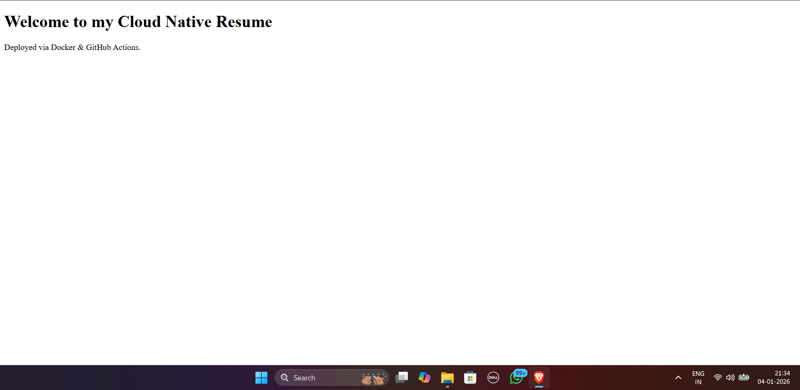

# cloud-native
# Cloud-Native Web Infrastructure (Docker + CI/CD)

## Overview
This project hosts a web application using **Docker containers** and implements a fully automated **CI/CD pipeline** using GitHub Actions.

## Tech Stack
* **Containerization:** Docker
* **Web Server:** Nginx (Alpine Linux)
* **CI/CD:** GitHub Actions
* **Cloud Provider:** AWS EC2

## CI/CD Pipeline Workflow
1.  **Push:** Code is pushed to the `main` branch.
2.  **Build:** GitHub Actions builds the Docker image.
3.  **Deploy:** The runner logs into AWS EC2 via SSH and updates the running container.

## Demo

Here is the cloud-native resume running inside a Docker container, served via Nginx.

